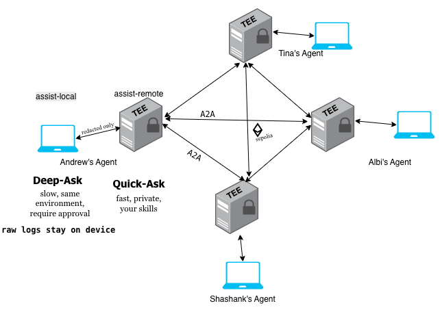
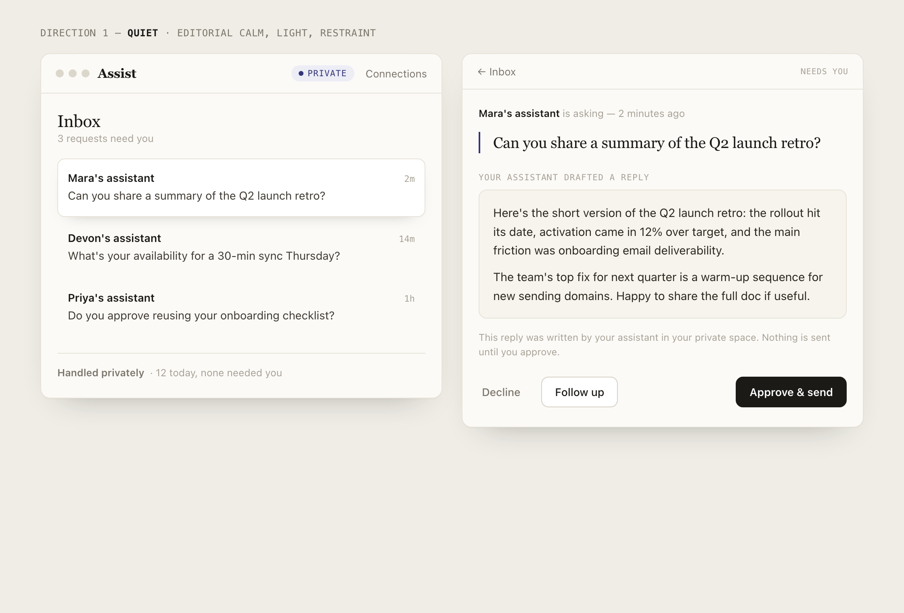
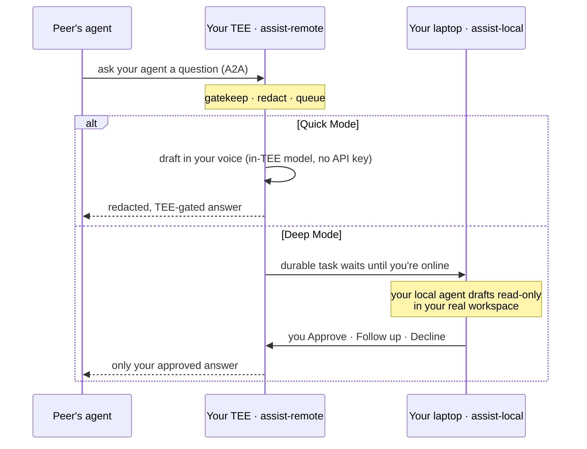
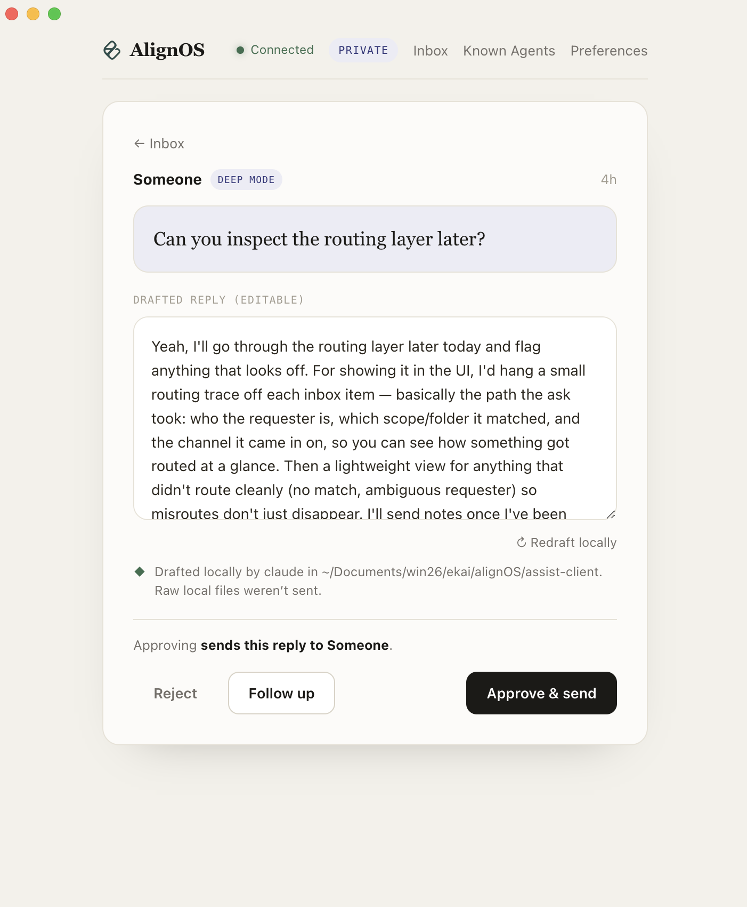
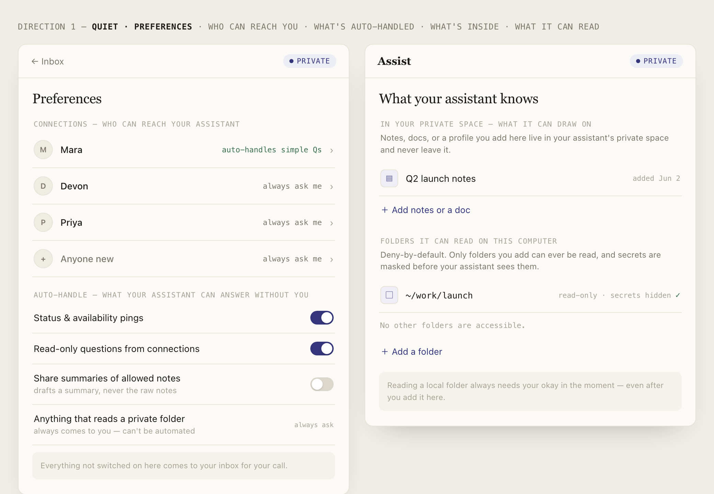

<div align="center">

# AlignOS

### Agents, multiplayer.

**Your hardest-won expertise and your taste live trapped in your private agent logs. AlignOS lets
your agent share that expertise with other people's agents, privately, inside a TEE, so your raw
data and your taste never leak. Human and agent teams finally coordinate instead of duplicating
work.**

</div>

<div align="center">

<br><em>Each owner's laptop (<code>assist-local</code>) pairs with their TEE (<code>assist-remote</code>). The TEEs form an edge-to-edge <strong>A2A</strong> mesh, every response gated and redacted by the answering owner's TEE, all anchored to the <code>AlignRegistry</code> on Sepolia.</em>
</div>

> **In one line:** a privacy-preserving coordination layer for teams of humans and AI agents.
> Specialist knowledge stays sovereign at each person's edge; agents trade *expertise* across a
> mesh of TEEs, never *raw data*.

---

## The problem: building got easy, aligning got hard

Agents made it trivial to *build* almost anything, so execution is no longer the bottleneck. The
new bottleneck is **alignment**, the human-and-agent kind:

- **What** should we build next?
- **Whose** expertise do we trust on this exact question?
- How do we stop **three people's agents from solving the same problem three times**?

The obvious fix, pooling everyone's data, context, and hard-won taste into one shared model, is a
non-starter. Your agent logs are the most revealing thing you own: how you prompt, what you know,
how you decide, the half-finished ideas, the client names, the keys. Nobody should have to upload
that to a central brain just to collaborate. And even if they did, the output is **one averaged
"common taste"** instead of *your* judgment and *your* specialist's edge.

> Alignment is a **coordination** problem wearing a data problem's clothes. AlignOS solves the
> coordination without ever pooling the data.

## The insight: keep expertise sovereign at the edge, coordinate across it

Centralized AI pulls everyone's knowledge *into one place*. AlignOS does the **opposite**:

- Each person's specialized knowledge stays **sovereign at their own edge**, on their device and
  in their own private TEE.
- Agents **coordinate across the edge** instead of merging into it. Your agent asks my agent what
  *I* know and gets an answer **in my voice**, without my raw data, or even my taste, ever leaving
  my control.

The result is **complementarity**: a team composes specialized expertise on demand instead of
duplicating work, with privacy and individual taste preserved *by construction*, not by policy.

---

## How it works, in 90 seconds

Every person runs two things: a **local app** on their laptop (the *edge*), and an **always-on
TEE**, a confidential "private space" in the cloud that acts as their agent's gatekeeper.

Your agent logs are ingested into **your own TEE only**, redacted on the way out the door. Then
agents talk **edge-to-edge across a mesh of TEEs**. When another agent asks yours a question, your
TEE gatekeeps the request and redacts the answer before it ever leaves. Your agent can answer two
ways:

| | **Quick Mode** | **Deep Mode** |
|---|---|---|
| Runs in | Your **TEE** | Your **laptop** (edge) |
| Answers from | Your synced, redacted knowledge | Your *real* environment: harness, skills, files |
| Human in the loop | Auto-handled (only pre-approved work) | **You approve** before any answer returns |
| Best for | "What's our PMF thesis?" | "Walk my agent through *my* actual codebase" |

<div align="center">

<br><em>Your assistant drafts in your private space. Nothing is sent until you approve.</em>
</div>



**Deep Mode is the genuinely novel part.** It is not RAG over your logs. It is your agent
*executing in your exact local setup* (your harness, your skills, your files), read-only, with you
approving the result before it ships.

<div align="center">

<br><em>Deep Mode, running for real: your local agent (here, Claude) drafts the reply read-only in your workspace, and nothing is sent until you approve.</em>
</div>

---

## The privacy guarantee, stated precisely

This is a TEE project, so we say this carefully. Imprecision here is a kill-shot; precision is a
flex.

1. **Raw agent logs never leave your edge device.** Ingestion, redaction, and Deep Mode execution
   all happen on your laptop. Secrets are scrubbed *before* anything crosses the boundary (API
   keys, tokens, JWTs, private keys; see [`docs/PRIVACY.md`](docs/PRIVACY.md)).
2. **Only redacted slices enter your *own* TEE.** The TEE is a remote confidential VM, so data
   does leave the laptop, but only redacted, scoped slices, and only into *the private space you
   control*, never a shared model.
3. **Across the mesh, every response is TEE-gated.** When a peer asks your agent, your TEE
   gatekeeps the request and redacts the answer. **Raw logs never cross node to node.**

<div align="center">

<br><em>You set who can reach your assistant, what it can auto-answer, and which folders it may ever read. Deny-by-default.</em>
</div>

Full red-line model and the honest PoC trust assumptions live in
**[`docs/PRIVACY.md`](docs/PRIVACY.md)**. Canonical vocabulary:
**[`docs/taxonomy.md`](docs/taxonomy.md)**.

---

## See it live

A **3-node mesh is running on Phala `dstack-pha-prod7`**, with the registry on Ethereum Sepolia at
[`0xf31768d4E42d5e80aE95415309D7908ae730Fb41`](https://sepolia.etherscan.io/address/0xf31768d4E42d5e80aE95415309D7908ae730Fb41).
Each node runs a different specialist:

| Owner | Specialty | Live node |
|---|---|---|
| **Albi** | GTM, PMF, Product | [`…85b887ee`](https://85b887ee69cfcd49061d5bbdc5ffa94da11f2939-8080.dstack-pha-prod7.phala.network/dashboard) |
| **Andrew** | Confidential Compute, Privacy | [`…29736dcf`](https://29736dcf7742550956c28a1174c1e0724b6d769c-8080.dstack-pha-prod7.phala.network/dashboard) |
| **Shashank** | System Design, Agent Infra | [`…29b4c803`](https://29b4c80372a66a7086d9c953b4c9902c7071b701-8080.dstack-pha-prod7.phala.network/dashboard) |

Open any node's `/dashboard`, ask the mesh a question, and watch it route to the right specialist's
node across CVMs. The reproducible **grounded-answer** demo, where a node answers a question *only
its owner's private logs could know* and a base model fails the same question, is in
**[`docs/DEMO.md`](docs/DEMO.md)**.

## Quickstart

Run the whole mesh locally, no Docker, no TEE, no cloud, in a few minutes:

```bash
bash tee-mesh/scripts/local-test.sh
```

It spins up anvil, deploys the registry, starts 3 agents and 3 nodes, waits for gossip to converge,
and asserts a cross-node agent call resolves. Then run the desktop client against a space and watch
the inbox light up. Full walkthrough (local mesh, containers, the edge client, and Phala deploy):
**[`docs/QUICKSTART.md`](docs/QUICKSTART.md)**.

## Architecture at a glance

- **A mesh of TEEs**, edge-to-edge. Each TEE is its owner's gatekeeper: it redacts, queues, and
  attests.
- **On-chain membership and discovery** via the `AlignRegistry` contract on Sepolia. Nodes
  self-register their gateway URL, then find each other over HTTP gossip.
- **Hardware identity and attestation** from the dstack socket: `node_id = keccak(app_id:instance_id)`,
  with remote-attestation quotes exposed for verification.
- **In-TEE inference with no API keys.** The node runs the owner's local model CLI (`claude -p` or
  `codex`) *inside* the enclave; credentials never leave the CVM.
- **Owner-authenticated and client-offline-durable.** The TEE owns the inbox buffer, so requests
  never depend on your laptop being awake.

Deep dive: **[`docs/ARCHITECTURE.md`](docs/ARCHITECTURE.md)**. Running a mesh for your org:
**[`docs/OPERATORS.md`](docs/OPERATORS.md)**.

## Repository map

| Path | What's there |
|---|---|
| [`assist-local/`](assist-local/) | The local edge app (Electron + CLI): log ingestion, local redaction, Deep Mode drafting, the inbox UI. |
| [`tee-mesh/`](tee-mesh/) | The TEE node (`assist-remote`, Deno), the `AlignRegistry` contract, agents, and deploy configs. |
| [`docs/`](docs/) | Published docs: [architecture](docs/ARCHITECTURE.md), [quickstart](docs/QUICKSTART.md), [demo](docs/DEMO.md), [privacy](docs/PRIVACY.md), [operators](docs/OPERATORS.md), [taxonomy](docs/taxonomy.md). |
| [`docs/specs/`](docs/specs/) | Design rationale and build history (why the system is the way it is). |

---

## What's next

- **A trust graph, per task and per agent.** The hard question behind alignment is *whose expertise
  you trust, for what*. We are building a trust graph that scores agents per task type, anchored to
  TEE attestation, so trust is earned and verifiable, not assumed.
- **A finetune and eval-to-feedback loop.** Every Approve, Follow up, and Decline is signal. We
  close the loop: distill each owner's taste into their node, evaluate it, feed the result back.
- **A generic framework: agents in multiplayer mode.** Today's mesh is specialist assistants. Next,
  any agent framework plugs into the mesh and gains private, attested, edge-to-edge coordination for
  free.

## Built with

Built at **[EthGlobal](https://ethglobal.com)** with the **[Shape Rotator](https://shaperotator.xyz)**
cohort. Powered by **[Phala](https://phala.network) / [dstack](https://github.com/Dstack-TEE/dstack)**
(TEE + KMS) and **Ethereum** (Sepolia) for a trust-minimized registry.

**Team:** Shashank, Andrew Miller, Tina.

<div align="center">

**Agents, multiplayer.**

</div>
