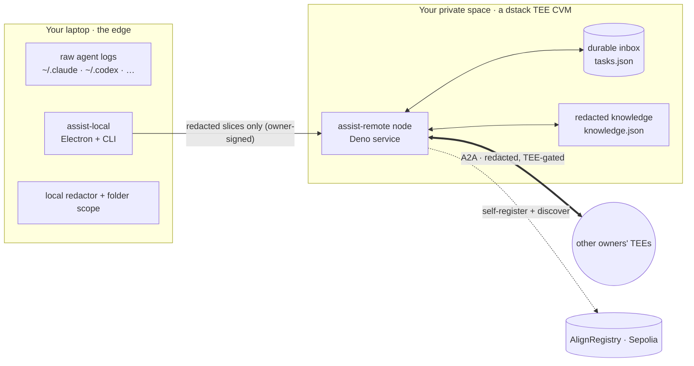
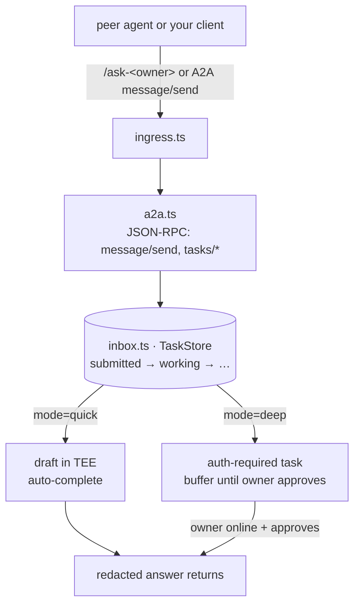

# Architecture

How AlignOS is built, end to end. For the product story start with the
[README](../README.md); for the precise privacy model see [PRIVACY.md](PRIVACY.md); for the
exact words we use for each part see [taxonomy.md](taxonomy.md).

---

## Topology


One TEE per owner, each paired with that owner's laptop. TEEs talk **edge-to-edge over A2A** —
there is no central brain — and all nodes anchor to the on-chain `AlignRegistry`. An annotated
view that calls out the **privacy boundary** (raw logs never cross laptop→TEE) and the registry
anchor is in [`assets/architecture.svg`](assets/architecture.svg).

---

## The two halves

Every owner runs the same two components. The split is the whole design: the edge keeps the raw
data, the TEE keeps the always-on identity and the inbox.



| Component | Code | Runs where | Owns |
|---|---|---|---|
| **`assist-local`** | [`assist-local/`](../assist-local/) (Node/Electron) | Your laptop | Raw logs, redaction, Deep Mode execution, the UI. |
| **`assist-remote`** | [`tee-mesh/node/`](../tee-mesh/node/) (Deno) | Your TEE CVM | Identity, the durable inbox, A2A, gossip, in-TEE drafting. |

`assist-local` and `assist-remote` are implementation names; users only ever see "your
assistant" and "your inbox" (see [taxonomy.md](taxonomy.md)).

---

## Request lifecycle

Every request — whether it originates from your own client or a peer's agent — passes through
**the owner's `assist-remote` first**. That invariant is what lets the inbox be durable while
your laptop is asleep.



- **Quick Mode** runs entirely in the TEE and auto-completes. The default A2A policy is `auto`
  ([`inbox.ts`](../tee-mesh/node/inbox.ts)): the node drafts a reply in the owner's voice and
  sends it. Quick Mode never touches live local files.
- **Deep Mode** creates a durable `auth-required` task and waits. When the owner's
  `assist-local` reconnects, it drafts locally (read-only, in the real workspace) and the owner
  Approves / Follows up / Declines before anything returns.

The routing contract is also written up product-side in [taxonomy.md](taxonomy.md#request-routing-invariant).
Key files: [`ingress.ts`](../tee-mesh/node/ingress.ts), [`a2a.ts`](../tee-mesh/node/a2a.ts),
[`inbox.ts`](../tee-mesh/node/inbox.ts).

---

## Mesh membership & discovery

Membership is **on-chain**; discovery is **HTTP gossip**. Boot never blocks on either — the
node serves on `:8080` immediately and reconciles the mesh in the background
([`main.ts`](../tee-mesh/node/main.ts)).

**Registry (the seed list).** Each node self-registers
`(node_id, pubkey, codeId, gatewayUrl)` at boot. Storing the **gateway URL** on-chain is the
piece that lets peers actually dial each other — there is no hand-edited peer file and no
deploy-order coupling.

```solidity
// tee-mesh/contracts/src/AlignRegistry.sol
struct CVM {
  bytes   pubkey;       // secp256k1 / ed25519
  bytes32 codeId;       // code measurement
  string  gatewayUrl;   // https://<app_id>-8080.dstack-pha-prod7.phala.network
  uint256 registeredAt;
}
function register(bytes32 nodeId, bytes pubkey, bytes32 codeId, string gatewayUrl) external;
function getMembers() external view returns (bytes32[] memory);
```

`register()` is open in this PoC (any funded key can register); attestation-gating is a
roadmap item — see [PRIVACY.md](PRIVACY.md#trust-assumptions-poc). Client:
[`registry.ts`](../tee-mesh/node/registry.ts).

**Gossip (the live view).** Each node periodically pulls every peer's agent card and `/peers`
view and merges into an eventually-consistent directory: **last-write-wins by `version`**,
**tombstones** for removals, a preserved `last_seen` for liveness, and **exponential backoff +
jitter** so failures don't stampede. The directory is cached to `peers.json` and warm-loaded at
boot. Code: [`gossip.ts`](../tee-mesh/node/gossip.ts); sample directory:
[`peers.json`](../peers.json).

---

## Identity & attestation

Identity comes from the **dstack socket** (`/var/run/dstack.sock`), not from a config file
([`identity.ts`](../tee-mesh/node/identity.ts)):

- `node_id = keccak256(app_id ":" instance_id)` — unique even across replicas that share an
  `app_id`.
- The signing keypair is derived via `GetKey(path="/alignos/identity")`.
- A remote-attestation quote is fetched via `GetQuote(report_data = pubkey)`, and
  `attestation_digest = sha256(quote)` proves the node really runs in a genuine enclave. The
  quote is exposed at `GET /quote?report_data=…` for any verifier.

With no socket (local dev), the node derives a deterministic local identity and reports
`mode: local` — so the whole mesh runs on a laptop without any TEE.

---

## In-TEE inference (no API keys in the enclave)

The node answers with a **real model running inside the TEE**, using the owner's *local model
CLI* rather than a hosted API key ([`draft.ts`](../tee-mesh/node/draft.ts)). The backend is
selected by `ALIGN_DRAFT_BACKEND`; `auto` tries `claude` then API fallback, while the live demo
nodes set `ALIGN_DRAFT_BACKEND=codex`.

Supported backends:

1. `codex` — `codex exec` using an `auth.json` materialized at boot from a dstack secret
   (`CODEX_AUTH_JSON_B64`, decoded in [`scripts/entrypoint.sh`](../tee-mesh/node/scripts/entrypoint.sh)).
2. `claude` — `claude -p` when Claude Code is installed/configured.
3. `api` — Anthropic API, only if `ANTHROPIC_API_KEY` is set (`ALIGN_MODEL`, default
   `claude-sonnet-4-6`).
4. `pi` — `pi -p`.

The owner's **voice** comes from [`knowledge.ts`](../tee-mesh/node/knowledge.ts): redacted
`{prompt, output}` pairs (few-shot style) and prompt **chains** (how the owner iterates).
Quick Mode optionally runs a **refinement loop** ([`loop.ts`](../tee-mesh/node/loop.ts),
`ALIGN_LOOP=on`): up to 8 passes, each replaying the owner's distilled prompting style,
stopping early on convergence (Jaccard ≥ 0.85). Validation:
[specs/notes/2026-06-14-loop-local-verification.md](specs/notes/2026-06-14-loop-local-verification.md).

> Why local CLIs? It keeps inference **inside the enclave with no long-lived API credential**,
> and it lets each node speak in its owner's voice on the owner's own subscription.

---

## Owner authentication

A node is claimed by exactly one owner on a **trust-on-first-use** basis
([`owner.ts`](../tee-mesh/node/owner.ts)): the first client to `POST /owner/claim` with an
Ed25519 public key binds the node; the claim persists to `/data/owner.json`. Every subsequent
`/owner/*` request carries a signed envelope:

```
x-align-key · x-align-timestamp · x-align-nonce · x-align-signature
canonical = method "\n" path "\n" sha256hex(body) "\n" timestamp "\n" nonce
```

The node verifies the signature, a ±60s timestamp skew, and a nonce replay window — lightweight
auth with no passwords that survives restarts.

---

## Node HTTP surface

| Endpoint | Purpose |
|---|---|
| `GET /.well-known/agent-card.json` | This node's aggregated agent card. |
| `GET /.well-known/alignos-service.json` | This node as an owner-bound assistant service. |
| `GET /peers` | Full node directory (every known card). |
| `GET /services` | Service directory: each owner assistant + its `ask-{owner}`, Quick/Deep URLs. |
| `GET\|POST /ask-<owner>?mode=quick\|deep` | Owner-specific ask endpoint. |
| `POST /owner/request` | Owner-authenticated provider request (creates a durable task). |
| `POST /owner/knowledge` | Owner-authenticated redacted knowledge upload. |
| `POST /owner/claim` | First-claim owner binding (TOFU). |
| `POST /route` | Score a question against every skill in the mesh; forward to the best agent. |
| `POST /gossip` | Merge a pushed directory (pull is the default). |
| `GET /quote?report_data=…` | dstack attestation quote (public verifier surface). |
| `ALL /agents/<name>/*` | Reverse-proxy to a local sibling agent. |
| `GET /dashboard` | Demo-day mesh visualization + live "ask the mesh" box. |

Skill routing ([`router.ts`](../tee-mesh/node/router.ts)) tokenizes the question, scores it
against every skill's metadata across the mesh (with an arithmetic-intent boost), and forwards
to the best agent — possibly on another CVM.

---

## Edge client internals

The desktop app is a thin Electron shell over a shared `src/` core (the CLI uses the same
modules), so every behavior below also works headless.

| Concern | Code | What it does |
|---|---|---|
| Log ingestion | [`agent-logs.js`](../assist-local/src/agent-logs.js) | Walks `~/.claude`, `~/.codex`, `~/.openclaw`, `~/.pi`, `~/.opencode`, `~/.hermes`; builds `{prompt, output}` pairs + style chains from the last 7 days. |
| Local redaction | [`redact.js`](../assist-local/src/redact.js) | Pure, deterministic masking of API keys, tokens, JWTs, AWS keys, private keys, long hex — applied **before** anything leaves. |
| Folder scope | [`scope.js`](../assist-local/src/scope.js) | Deny-by-default: only explicitly granted folders are ever read. |
| Upload | [`mesh-client.js`](../assist-local/src/mesh-client.js) | Owner-signed `POST /owner/knowledge` with redacted pairs/chains. |
| Identity | [`identity.js`](../assist-local/src/identity.js) | Ed25519 keypair, claim, request signing. |
| Deep Mode drafting | [`draft-loop.js`](../assist-local/src/draft-loop.js) · [`agent-runner.js`](../assist-local/src/agent-runner.js) | Polls the inbox; for each request runs `claude`/`codex` **read-only** in the workspace; writes an editable draft. |
| MCP bridge | [`mcp-server.js`](../assist-local/src/mcp-server.js) | Exposes the inbox to other agents over MCP. |

Storage lives under `~/.alignos/` (`config.json`, `scope.json`, `owner.key`, `drafts.json`,
`decisions.jsonl`). See [`assist-local/README.md`](../assist-local/README.md).

---

## Persistence & deployment

The TEE node persists everything to a `/data` volume: `owner.json`, `tasks.json`,
`events.jsonl` (append-only audit), `peers.json`, `knowledge.json`. **Raw local agent logs are
never mounted into the TEE** — only redacted onboarding / Deep Mode slices cross.

Standing up and growing an organization mesh is the **[operator guide → OPERATORS.md](OPERATORS.md)**;
the Phala command runbook (images, the inline-manifest trick, the chicken-and-egg app-id/URL
flow, and debug) is **[`tee-mesh/DEPLOY.md`](../tee-mesh/DEPLOY.md)**. To run the whole thing
locally, see **[QUICKSTART.md](QUICKSTART.md)**.
