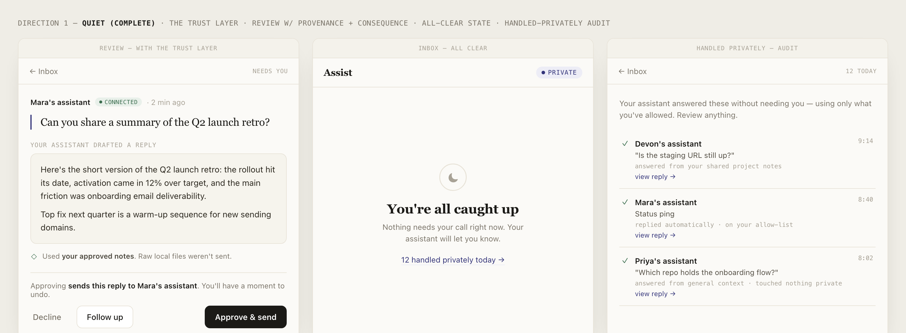

# Demo

One undeniable moment, plus two supporting beats. Everything here is reproducible.

---

## 1. The grounded answer (the "wow")

**Claim:** a node can answer a question that **only its owner's private agent logs could
know** — and a base foundation model, asked the same thing, cannot. The knowledge is real, it's
specific to that person, **and it never left their TEE.**

**On stage (≈75s):** ask Andrew's node a real, narrow TEE bug that he actually hit and solved —
something whose fix lives in his `~/.claude` / `~/.codex` trace, not in any model's training
data.

```bash
# Grounding ON — Andrew's node, answering from his synced (redacted) knowledge, in his voice
curl -sG "https://29736dcf7742550956c28a1174c1e0724b6d769c-8080.dstack-pha-prod7.phala.network/ask-andrew" \
  --data-urlencode "mode=quick" \
  --data-urlencode "q=<the specific bug>"
# → nails the fix, in Andrew's voice, citing the shape of his actual trace
```

Then ask a **base model** the same question and watch it generalize, hedge, or miss the
specific cause. The contrast *is* the pitch: privacy + taste + specialization, proven in one
minute.

> "This knowledge exists only in Andrew's logs. No foundation model has it — and it never left
> his TEE. My agent just learned it from his agent, redacted and gated the whole way."

### The 3-way ablation (do this first — it's what the demo rests on)

To make the claim airtight, show three states of the **same** question:

| Run | Setup | Expected |
|---|---|---|
| **Base** | A bare `claude -p "<question>"` with no grounding | Fumbles / generic |
| **Grounded** | The node with the owner's `knowledge.json` seeded | Nails it + cites the trace |
| **Grounded, trace deleted** | Same node with that specific knowledge removed | Visibly degrades |

The grounding signal is the owner's redacted `knowledge.json` (prompt/output **pairs** + prompt
**chains**) that the edge client uploads at onboarding. Toggling it on/off is the ablation.

**Reproduce locally** (no TEE needed) with a single node on your own Claude subscription:

```bash
# 1. Boot a standalone node with a real model backend
bash tee-mesh/node/scripts/dev-local.sh          # node on :8787, ALIGN_DRAFT_BACKEND=claude

# 2. Seed it with your agent logs (redacted) via the client
cd assist-local && node bin/alignos setup --url http://localhost:8787

# 3. Ask in quick mode — grounded, in your voice
node bin/alignos ask --owner shashank --mode quick "<a question only your logs answer well>"

# 4. Ablate: clear the node's knowledge and ask again — watch it degrade
#    (knowledge lives in $ALIGN_KNOWLEDGE, default /tmp/align-dev-knowledge.json)
```

To show the **owner-style refinement loop** (the answer improving across passes, in the owner's
prompting style), restart the node with `ALIGN_LOOP=on ALIGN_LOOP_PASSES=6`. This behavior was
verified end-to-end in
[specs/notes/2026-06-14-loop-local-verification.md](specs/notes/2026-06-14-loop-local-verification.md)
(M0: placeholder killed → real answer; M1: six passes ran; M2: the node reproduced the owner's
distilled prompting moves — *broad→narrow, terse imperative, one axis at a time* — not a generic
agent loop).

---

## 2. The mesh routes to the right specialist

Show that a question finds the right expert's node across CVMs, automatically:

```bash
bash tee-mesh/scripts/e2e-routing.sh \
  https://85b887ee69cfcd49061d5bbdc5ffa94da11f2939-8080.dstack-pha-prod7.phala.network
```

```
PASS  "how should we find PMF?"                        -> albi      (GTM)
PASS  "how does remote attestation work in a TEE?"     -> andrew    (Confidential Compute)
PASS  "how should we design the agent routing layer?"  -> shashank  (System Design)
```

Or open any node's **`/dashboard`** and use the live "ask the mesh" box — you'll watch each
question land on a different node.

---

## 3. Deep Mode — you stay in charge

The genuinely novel beat: a request can be answered by your agent running in your **exact local
environment** (harness, skills, files), read-only, and **nothing returns until you approve**.

Request → push notification → one-tap **Approve** → the answer returns. On stage this is best
**pre-recorded or compressed to ~10 seconds**, because the approval is async by design (that's
the privacy feature — dead air on stage is not).

<div align="center">

<br><em>Every auto-handled answer is logged with what it was allowed to use — "raw local files weren't sent."</em>
</div>

---

## Live endpoints

| Owner | Specialty | Dashboard |
|---|---|---|
| Albi | GTM · PMF · Product | `https://85b887ee69cfcd49061d5bbdc5ffa94da11f2939-8080.dstack-pha-prod7.phala.network/dashboard` |
| Andrew | Confidential Compute · Privacy | `https://29736dcf7742550956c28a1174c1e0724b6d769c-8080.dstack-pha-prod7.phala.network/dashboard` |
| Shashank | System Design · Agent Infra | `https://29b4c80372a66a7086d9c953b4c9902c7071b701-8080.dstack-pha-prod7.phala.network/dashboard` |

Registry on Ethereum Sepolia:
[`0xf31768d4E42d5e80aE95415309D7908ae730Fb41`](https://sepolia.etherscan.io/address/0xf31768d4E42d5e80aE95415309D7908ae730Fb41).
`curl <node>/peers` shows all three nodes; `curl <node>/services` shows the owner-bound
assistants.

> A 90-second screen recording of the grounded-answer moment is a safer demo link than a cold
> live URL — record it once the ablation above is clean.
