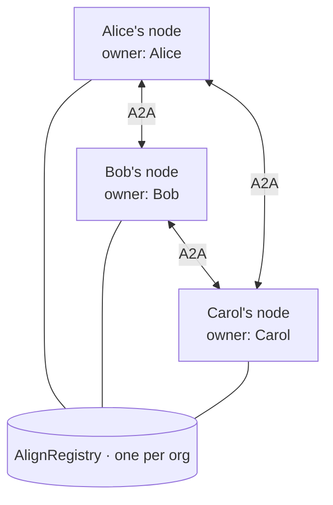
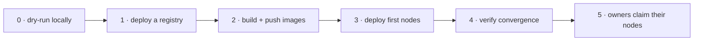
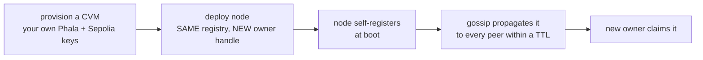

# Operator guide — running an organization mesh

This is the operator's view: how to stand up an AlignOS mesh for your organization and grow it
one node at a time. For the exact deploy commands, image build, and the debug runbook, this
guide points you to **[`tee-mesh/DEPLOY.md`](../tee-mesh/DEPLOY.md)** rather than repeating them.

## Operator vs owner

AlignOS separates two roles on purpose (see [taxonomy.md](taxonomy.md)):

| Role | Does | Holds |
|---|---|---|
| **Operator** | Provisions and maintains the TEE/CVM instances and (optionally) the registry. | Phala workspace access; deploy keys. |
| **Owner** | Claims one node and controls that assistant's inbox, knowledge, and preferences. | A local Ed25519 owner key. |

An operator may stand up many nodes; **each node becomes controlled by exactly one owner** after
that owner claims it from the client. The operator never sees the owner's data — claim binds the
node to the owner's key, and raw logs never enter the TEE.

## What an "organization mesh" is

There is **no central server**. An org mesh is just:

- **one shared registry** (an `AlignRegistry` contract) that everyone's node registers into, plus
- **one TEE node per member**, each owned by that member and each running their own specialist.

Nodes find each other through the registry + gossip, and talk **edge-to-edge over A2A**. Adding a
person means adding a node — nothing else reconfigures.



---

## Start a new organization mesh



**0 · Dry-run the whole mesh locally first** (no Phala, no TEE — proves your config end to end):

```bash
bash tee-mesh/scripts/local-test.sh
```

**1 · Deploy your org's registry** (or reuse an existing one). A fresh registry makes your mesh
self-contained:

```bash
PRIVATE_KEY=0x<sepolia-funded key> bash tee-mesh/scripts/deploy-registry.sh
# → prints REGISTRY_CONTRACT=0x…  — this address IS your org's mesh identity
```

The node is chain-agnostic: point `REGISTRY_RPC` at any EVM chain you like. (Reusing the public
demo registry instead just means your nodes share a discovery namespace with the demo.)

**2 · Build and push the node + skill images** to a registry your CVMs can pull from (ghcr).
Commands: [`DEPLOY.md` → Images](../tee-mesh/DEPLOY.md#images-pulled-by-the-cvm-from-ghcr--build-contexts-do-not-work-remotely).

**3 · Deploy your first nodes** — one per member, each with a **distinct** owner handle, skill,
and manifest, all sharing the **same** `REGISTRY_CONTRACT`. Full chicken-and-egg flow
(deploy → get `app_id`/gateway URL → set `ALIGN_SELF_URL` → upgrade in place → restart):
[`DEPLOY.md` → Deploy a node](../tee-mesh/DEPLOY.md#deploy-a-node-chicken-and-egg-app_idurl-unknown-until-first-deploy).
The per-node knobs that make each one a different specialist:

```
SKILL=alice
ALIGN_OWNER_HANDLE=alice
ALIGN_OWNER_DISPLAY_NAME=Alice
ALIGN_MANIFEST_JSON=[{"name":"alice","url":"http://skill:8080"}]
REGISTRY_CONTRACT=0x…   # SAME for every node in the org
```

**4 · Verify the mesh converged** — every node should see every other within a gossip TTL:

```bash
URL=https://<app_id>-8080.dstack-pha-prod7.phala.network
curl $URL/peers      # all nodes + their skills
curl $URL/services   # owner-bound assistants
cast call $REGISTRY_CONTRACT "getMembers()(bytes32[])" --rpc-url $REGISTRY_RPC
```

**5 · Hand each gateway URL to its owner.** They claim it from the client — setup is tokenless,
the first client to connect binds the node to its owner key:

```bash
cd assist-local && node bin/alignos setup --url https://<app_id>-8080.dstack-pha-prod7.phala.network
```

The mesh is now live. See [DEMO.md](DEMO.md) to exercise it.

---

## Add a new node to an existing mesh

The whole point of the registry-and-gossip design: **adding a node touches nothing that already
runs.** A new member (or you, on their behalf) does this with their *own* keys — zero shared
secrets:



1. **Use your own credentials.** Your own Phala API key (`npx phala auth login`) and your own
   Sepolia-funded key — you manage your CVMs, you can't touch anyone else's. (Background:
   [`DEPLOY.md` → Credentials](../tee-mesh/DEPLOY.md#credentials--whats-yours-vs-shared).)
2. **Deploy the node with the same `REGISTRY_CONTRACT`** as the rest of the org and a **distinct**
   `ALIGN_OWNER_HANDLE` + skill + manifest (same per-node knobs as step 3 above).
3. **It self-registers at boot** `(node_id, pubkey, codeId, gatewayUrl)` and gossip carries the
   new card to every existing node within a TTL — you do **not** redeploy or edit the others.
4. **Verify** it shows up everywhere (`curl <any-existing-node>/peers` now lists the newcomer),
   then the **new owner claims** it with `alignos setup --url …`.

> Give each node **its own Sepolia key.** Several nodes sharing one key can collide on transaction
> nonces if they boot together (stagger restarts ~40s apart otherwise). See
> [`DEPLOY.md` → Debug runbook](../tee-mesh/DEPLOY.md#debug-runbook-symptom--cause--fix).

---

## Operator notes (the things that bite)

- **Secrets stay local.** `PRIVATE_KEY`, `CODEX_AUTH_JSON_B64`, and any auth live only in
  gitignored `deploy/.env*` or dstack secrets — never committed. Each `.env` line must be
  newline-terminated (concatenated values produce "invalid dns name").
- **Upgrade in place, then restart.** `phala deploy --cvm-id …` then `phala cvms restart …` —
  never delete-and-redeploy (you'd lose the `app_id`/gateway URL and the `/data` volume). Use a
  fresh image tag (`:vN`) per change so the CVM re-pulls.
- **Persistence is the `/data` volume** — `owner.json`, `tasks.json`, `events.jsonl`,
  `peers.json`, `knowledge.json`. Raw local agent logs are never mounted here; only redacted
  slices are written. (Details: [PRIVACY.md](PRIVACY.md).)
- **Identity & attestation** come from the dstack socket — `node_id = keccak(app_id:instance_id)`,
  and each node serves its remote-attestation quote at `GET /quote`. Anyone can verify a node is
  a genuine enclave running the expected code measurement (`codeId`).
- **Owner claim is trust-on-first-use.** The first client to claim a fresh node owns it;
  re-claiming with a new key repairs state after a device change. Operators provision; owners
  claim.
- **Decommission** by stopping the CVM; the node's tombstone propagates through gossip
  (`deleted=true`) and peers drop it. Liveness backoff also ages out unreachable nodes.

### Current PoC trust boundary

`AlignRegistry.register()` is **open** today — any funded key can register. **Attestation-gated
registration** (only nodes presenting a valid dstack quote may join) is the first roadmap item
and pairs directly with the Flashbots/TEE direction. Until then, treat registry membership as
discovery, and verify a node's `/quote` before trusting it. See
[PRIVACY.md → Trust assumptions](PRIVACY.md#trust-assumptions-poc).

---

**See also:** [DEPLOY.md](../tee-mesh/DEPLOY.md) (command runbook + debug) ·
[ARCHITECTURE.md](ARCHITECTURE.md) (how identity, registry, and gossip work) ·
[QUICKSTART.md](QUICKSTART.md) (run it locally first).
