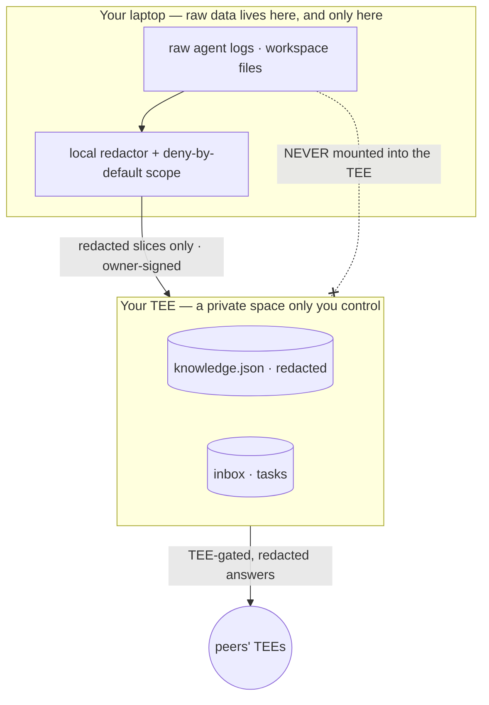

# Privacy model

We state this precisely on purpose. AlignOS is judged by people who build TEEs — a hand-wavy
privacy claim is a kill-shot, and an exact one is a flex. So here is exactly what crosses which
boundary, and what we do **not** yet claim.

## The one sentence

> **Raw agent logs never leave your edge device. Only redacted slices enter your *own* TEE. And
> across the mesh, every response is gatekept and redacted by the owner's TEE — raw logs never
> cross node-to-node.**

Note what this deliberately does *not* say. It does **not** say "nothing leaves your laptop" —
that would be false, because the TEE is a remote confidential VM. Data does leave the laptop;
the point is *what* leaves (redacted slices, never raw logs) and *where it goes* (a private
space you alone control, never a shared model).

## The boundaries

**Boundary 1 — laptop → your TEE.** Ingestion, redaction, and Deep Mode execution happen on the
edge. What crosses is a redacted, scoped digest — never the raw logs or files.

**Boundary 2 — your TEE → the mesh.** A peer's request is handled *inside* your TEE, which
gatekeeps it and redacts the reply before it leaves. Raw logs are never mounted into the TEE in
the first place, so they cannot cross node-to-node.

**Boundary 3 — Deep Mode → anyone.** When a task needs your real environment, your agent runs
**read-only** on your laptop and **nothing returns until you approve**. Only the reviewed reply
is sent.

## What actually enforces it (in code)

**Local redaction before anything leaves** — [`assist-local/src/redact.js`](../assist-local/src/redact.js).
A pure, deterministic scrubber (no I/O, never throws) runs on text *before* it crosses Boundary
1. It masks each match to its first 3 characters + `▮▮▮▮▮▮`. Current detector set:

| Detector | Catches |
|---|---|
| `sk-(ant-\|proj-)?…` | Anthropic / OpenAI-style API keys |
| `gh[pousr]_…` | GitHub tokens |
| `xox[baprs]-…` | Slack tokens |
| `AKIA[0-9A-Z]{16}` | AWS access key IDs |
| `eyJ….….…` | JWTs |
| `-----BEGIN … PRIVATE KEY-----` | PEM private keys |
| `[A-Fa-f0-9]{40,}` | Long hex secrets |

**Deny-by-default folder scope** — [`assist-local/src/scope.js`](../assist-local/src/scope.js).
The local log reader and Deep Mode may only touch folders the owner has **explicitly granted**
(`~/.alignos/scope.json`); `allows(path)` returns true only if the path is, or is under, a
granted folder. Nothing is readable until you opt it in.

**Owner-authenticated uploads** — [`mesh-client.js`](../assist-local/src/mesh-client.js) +
[`owner.ts`](../tee-mesh/node/owner.ts). Only the owner's Ed25519 key can write knowledge to the
TEE, via signed request envelopes.

**The TEE's `/data` volume** holds `owner.json`, `tasks.json`, `events.jsonl` (append-only
audit), `peers.json`, and `knowledge.json`. **Raw local agent logs are not among them and are
never mounted** — only redacted onboarding / Deep Mode slices are written.

**In-TEE inference uses no long-lived API key** — [`draft.ts`](../tee-mesh/node/draft.ts). The
node drafts with the owner's local model CLI inside the enclave; no hosted API credential lives
in the CVM.

## Trust assumptions (PoC)

Being honest about the current proof-of-concept boundary is part of the claim:

- **The registry is open.** `AlignRegistry.register()`
  ([`AlignRegistry.sol`](../tee-mesh/contracts/src/AlignRegistry.sol)) accepts any funded key
  today. **Attestation-gated registration** — only nodes presenting a valid dstack quote may
  join — is the first roadmap item, and it pairs directly with the Flashbots/TEE direction.
- **Owner binding is trust-on-first-use.** The first client to claim a fresh node owns it
  ([`owner.ts`](../tee-mesh/node/owner.ts)). Operators provision nodes; owners claim them.
- **Redaction is a starter detector set.** The regex detectors above catch common secret
  shapes, not every possible secret. The structural guarantee does not depend on them being
  exhaustive: raw logs are *never mounted into the TEE* and Deep Mode is *read-only + owner-
  approved* — redaction is defense-in-depth on top of that, not the only line.
- **Attestation is exposed, not yet enforced end-to-end.** Each node derives identity from the
  dstack socket and serves its quote at `GET /quote` ([`identity.ts`](../tee-mesh/node/identity.ts));
  peers can verify it. Making verification a hard precondition for A2A is on the roadmap.

## See also

- [taxonomy.md](taxonomy.md) — the exact, drift-free vocabulary (`assist-local`,
  `assist-remote`, "private space", Quick/Deep Mode).
- [ARCHITECTURE.md](ARCHITECTURE.md) — how identity, attestation, and the inbox are built.
